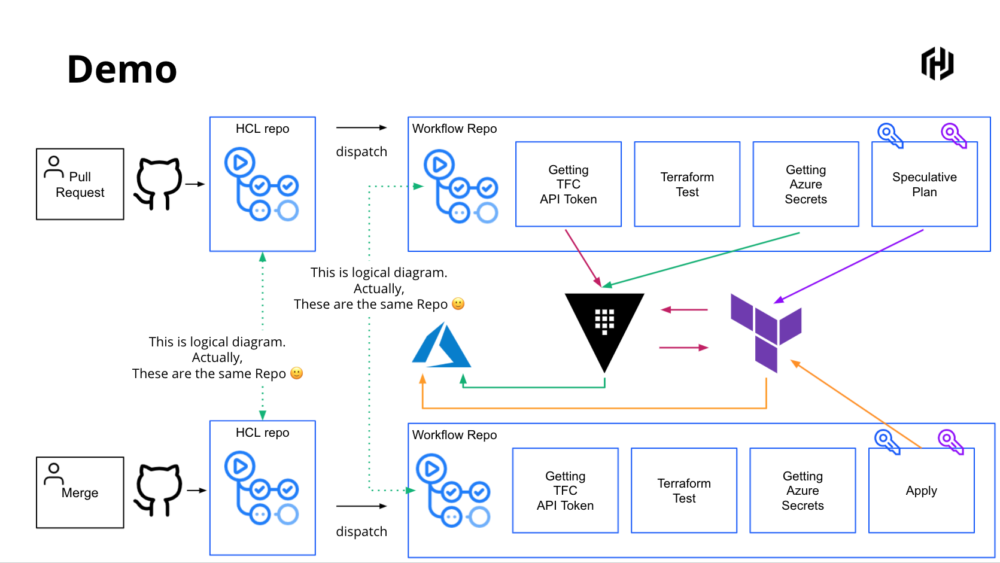

HCL Repo: https://github.com/tkaburagi/tf-vault-github-actions-src
Workflow Repo: https://github.com/tkaburagi/tf-vault-github-actions-workflow

## preparation

### Vault Setup
```
 vault secrets enable -path=tfc terraform
 vault secrets enable -path=secret/ kv-v2
 vaukt secrets enable azure
 vault write tfc/role/ci-user user_id=user-xxxxxxxx
 vault write tfc/config token=xxxxxxxxx
 vault kv put secret/azure/environment \
    subscription_id="" \
    tenant_id=""
 vault write azure/config \
    subscription_id="${SUB_ID}" \
    client_id="${CLIENT_ID}" \
    client_secret="${CLIENT_SECRET}" \
    tenant_id="${TENANT_ID}"
vault policy write azure-read policy.hcl
vault token create -policy azure-read -orphan
```

### GitHub Setup (Workflow Repo)
```
curl \
  --header "Authorization: Bearer $TOKEN" \
  --header "Content-Type: application/vnd.api+json" \
  https://app.terraform.io/api/v2/organizations/tkaburagi/workspaces
```
* `repo` -> `settings` -> `secrets` -> `VAULT_TOKEN`
* `repo` -> `settings` -> `secrets` -> `WS_ID`